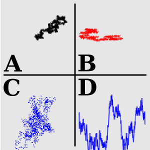

# getRndWalk
The interface for simulating random walk in a closed system.  
https://github.com/YujiSODE/getRndWalk

>Copyright (c) 2017 Yuji SODE \<yuji.sode@gmail.com\>  
>This software is released under the MIT License.  
>See LICENSE or http://opensource.org/licenses/mit-license.php
______

These functions return function that simulates random walk in a closed system.  
  
__Figure 1. Screenshot.__  
__A.__ `type:"lines", maxStep: 5000`. __B.__ `type:"points", maxStep:1000, sampleX:'-1,1,2,-2', sampleY:"default"`.  
__C.__ `type:"points", maxStep:1000, sampleX:'-1,1,2,-2', sampleY:'3,-3,1,-1'`.  
__D.__ `type:"lines", maxStep:500, sampleX:'0.25,0.125', sampleY:'3,5,-3,-5'`.

## Script
* `getRndWalkL.js`  
  >`getRndWalkL(canvasId,rgb)`: draw type = `lines`
* `getRndWalkP.js`  
  >`getRndWalkP(canvasId,rgb)`: draw type = `points`

## Paremeter
* `canvasId`: id of target canvas.
* `rgb`: RGB color.

## Returned function
1. `var y= getRndWalkP(canvasId,rgb)`|`getRndWalkL(canvasId,rgb);`
2. `y(title,x0,y0,maxStep[,sampleX,sampleY]);`
3. `y.logs;`|`y.end();`

#### 1. Parameters for returned function
* `title`: description of simulation.  

* `x0` and `y0`: initial values.  

* `maxStep`: the max step that is equivalent to positive integer; simulating process is not canceled  
  without calling method "`end()`" when `maxStep = 0`.  
  
* `sampleX` and `sampleY`: [optional] csv formatted numerical texts.

#### 2. Property and method of returned function
* `logs`: array that has simulation results as Log objects.  

* `end()`: method to end simulation; it shows result.

#### 3. Log objects
These object can be accessed with a property `logs` in returned function, as an array.  
A Log object has properties as follows:
* `title`: description of simulation.
* `step`: number of steps.
* `maxStep`: number of the uppermost steps.
* `color`: color for drawing.
* `x0` and `y0`: initial values in a coordinates.
* `x` and `y`: final values in a coordinates.
* `time`: timestamp.
* `type`: draw type (`points`|`lines`).
